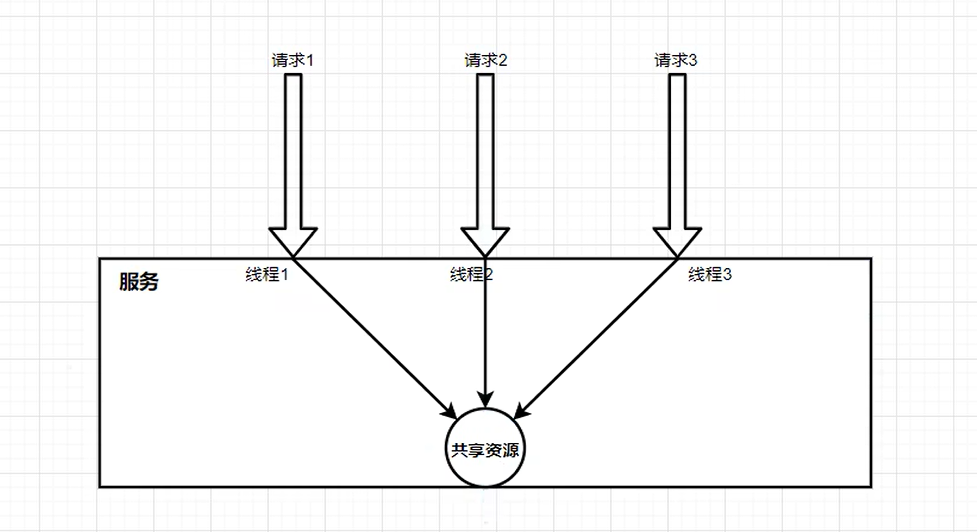
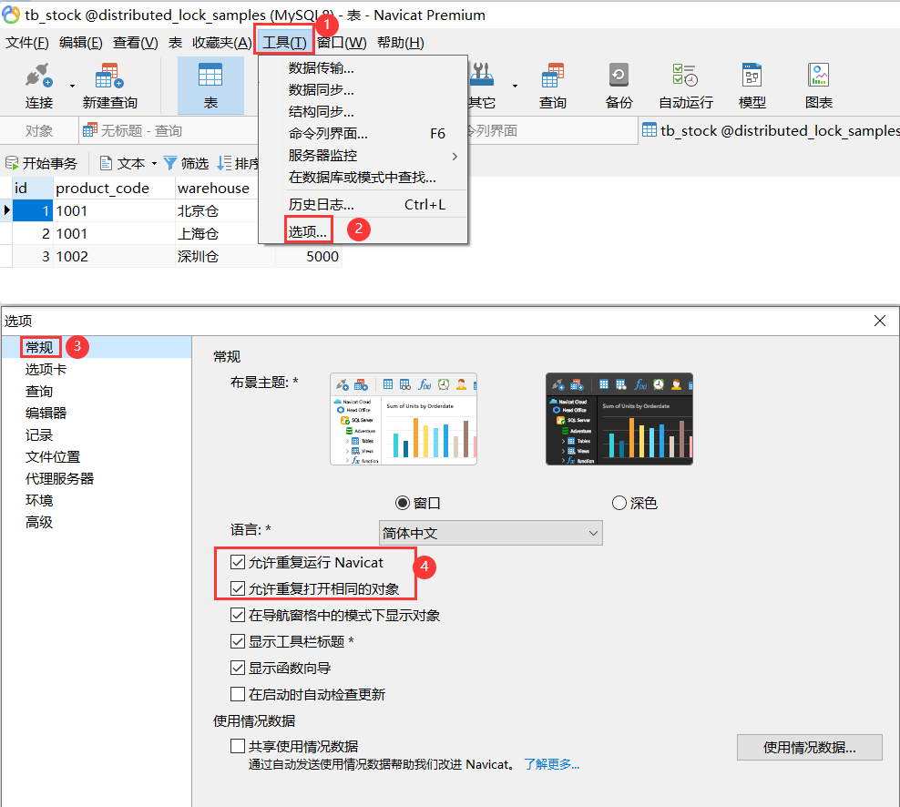

# 分布式锁

## jvm本地锁

### 概念
**jvm本地锁**就是常见的应用程序的锁机制，也就是使用 `synchronized` 以及 **JUC** 包下的 `ReentrantLock` 锁等等对程序进行并发控制的机制。

### 示意图



### MySQL数据库下jvm锁失效的情况
记住锁失效的前提必须是使用了**锁机制**，同时还配合数据库来使用，这里以 MySQL 举例说明，导致jvm锁失效的情况，其他数据库请自行测试。

- **多例模式**

多例模式就是创建多个相同的应用程序实例，各个程序之间相互隔离。此方式下会导致锁失效，具体代码参考 `PrototypePatternStockServiceImpl`。 

这里贴出核心关键代码，代码如下：
```java
/**
 * 库存业务 接口实现类
 * （多例模式，注意和单例模式的区别）
 * <p>
 * 注意：当使用多例模式情况下，要保证 proxyMode 的值不为 ScopedProxyMode.DEFAULT(与ScopedProxyMode.NO等同)，
 * 否则只改变 value 的值为 “prototype”，此时还是按照单例模式来处理
 * <p>
 * 扩展：原生 spring 默认使用 jdk 动态代理（实现接口），而 SpringBoot 2.X 使用 CGLIB 代理（基于类代理），由于这里采用的是实现类方式，所以使用 jdk 动态代理方式
 */
// @Scope(value = ConfigurableBeanFactory.SCOPE_PROTOTYPE)
@Scope(value = ConfigurableBeanFactory.SCOPE_PROTOTYPE, proxyMode = ScopedProxyMode.INTERFACES)
public class PrototypePatternStockServiceImpl implements IPrototypePatternStockService {

    /**
     * 减库存（超卖问题），基于 MySQL 数据库，使用 synchronized 锁，多例模式下，此方式会失效
     */
    @Override
    public synchronized void baseMysqlDeductWithSynchronizedLock() {
        // ...
    }

    /**
     * 减库存（超卖问题），基于 MySQL 数据库，使用 ReentrantLock 锁，多例模式下，此方式会失效
     */
    @Override
    public void baseMysqlDeductWithReentrantLock() {
        // ...
    }
}
```

- **spring 事务**

基于 **spring** 事务来处理，使用 `@Transactional` 注解来实现事务，底层利用 aop 思想实现的。此方式下会导致锁失效，可以通过使用“读未提交”[事务隔离级别](事务隔离级别.md)来解决失效问题，但实际项目不采取这么用，具体代码参考 `TransactionalStockServiceImpl`

这里贴出核心关键代码，代码如下：

```java
/**
 * 库存业务 接口实现类
 * 基于 spring 事务来处理
 */
public class TransactionalStockServiceImpl implements ITransactionalStockService {

    /**
     * 减库存（超卖问题），基于 MySQL 数据库，使用 事务 + synchronized 锁，spring 事务模式下，此方式会失效
     * <p>
     * 为什么会失效呢？因为 MySQL 默认事务隔离级别为 “可重复读”（repeatable read 简称 rr）
     * <p>
     * 要想解决这个问题，可以参考 {@link TransactionalStockServiceImpl#baseMysqlDeductWithReentrantLock} 方法事务的使用，
     * 其实就是 {@code @Transactional} 注解将隔离级别从 “默认”（aop 底层默认采用数据库的隔离级别） 改为 “读未提交”（read uncommitted 简称 ru），
     * 这样一来就可以读取还未提交的数据，但是也有缺点，会带来脏读等问题。这里只在当前示例中这样使用，但是实际互联网项目中采用的是 “读已提交”（read committed 简称 rc）事务隔离级别
     */
    @Override
    @Transactional
    public synchronized void baseMysqlDeductWithSynchronizedLock() {
        // ...
    }

    /**
     * 减库存（超卖问题），基于 MySQL 数据库，使用 事务 + ReentrantLock 锁，使用 spring 下的 “读未提交” 事务隔离级别来解决，并发失效的问题
     * <p>
     * 注意：这里只在当前示例中这样使用，但是实际互联网项目中采用的是 “读已提交”（read committed 简称 rc）事务隔离级别
     */
    @Override
    @Transactional(isolation = Isolation.READ_UNCOMMITTED)
    public void baseMysqlDeductWithReentrantLock() {
        // ...
    }
}
```

- **应用程序集群部署**

从思想来理解的话，其实跟多例模式的情况类似，只是所处的容器不同而已。集群部署需要使用 nginx 均衡负载，nginx.conf配置内容如下：

```text
worker_processes  1;

events {
    worker_connections  1024;
}


http {
    include       mime.types;
    default_type  application/octet-stream;

    sendfile        on;
    keepalive_timeout  65;
	
    # 负载均衡
    upstream distributedLockSample {
        server localhost:10010;
        server localhost:10086;
    }

    server {
        listen       80;
        server_name  localhost;

        # 反向代理
        location / {
            proxy_pass http://distributedLockSample;
        }
    }
}
```
为了测试集群，使用idea开2个不同的实例，配置实例截图如下：


环境变量设置如下：
```text
--server.port=10086
```

上述就是 MySQL 下导致 jvm 锁失效的三种情况。那么我们是不是只需要避免这种三种情况就行了？其实实际的业务需求中，多例模式情况下，我们是可以避免的，但是 spring 事务和集群部署情况是无法避免的。 因此我们需要使用其他方式来解决。

- 这里最简单的方式就是利用 MySQL 的**原子性**，也就是“行锁”或者“表锁”。所以需要修改 SQL 的执行逻辑，参考 `StockMapper.xml` 的代码逻辑。代码如下：
```xml
<update id="updateStock">
    UPDATE tb_stock
    SET count = count - #{count}
    WHERE
    product_code = #{productCode}
    AND count >= #{count}
</update>
```
但是有如下三个问题存在（2和3比较好理解，1通过悲观锁来说明）：
1. 锁范围问题，是表级锁还是行级锁，需要考虑范围，以下通过悲观锁思想来说明这个问题；

2. 同一个商品有多条库存记录，需要编写对应的 SQL 实现，较为复杂；

为了演示这个实例，插入一条新数据。
```sql
INSERT INTO `distributed_lock_samples`.`tb_stock`(`id`, `product_code`, `warehouse`, `count`) VALUES (2, '1001', '上海仓', 5000);
```
现象：当使用 `StockMapper.xml` 进行查询 productCode 为 "1001" 的数据会出现2条，这2条都会减库存，显然不符合逻辑，这里只是举个例子，具体的应用场景要结合业务来编写对应的SQL。

3. 无法记录库存变化前后的状态，比如查询减库存之后的数据，只能重新执行查询 SQL；

- 悲观锁（select ... for update）

为了演示这个悲观锁实例，往数据库再插入一条新数据。
```sql
INSERT INTO `distributed_lock_samples`.`tb_stock`(`id`, `product_code`, `warehouse`, `count`) VALUES (3, '1002', '深圳仓', 5000);
```
通过开启 Navicat 的2个命令行窗口来演示这个效果，如下图所示：


命令行窗口1 SQL 内容如下：
```mysql
-- 开启事务
begin;

-- 修改产品编号为 “1001” 的库存 SQL
UPDATE tb_stock SET count = count - 1 WHERE product_code = '1001' AND count >= 1;
```

命令行窗口2 SQL 内容如下：
```mysql
-- 修改编号为 3 的库存 SQL
UPDATE tb_stock SET count = count - 1 WHERE id = 3;
-- 回车之后，命令行窗口处于阻塞状态
```

通过截图步骤不难看出，`StockMapper.xml` 对应 SQL 锁的范围使用的是“表级锁”，当命令行窗口1未执行提交事务命令（commit;）或者回滚事务命令(rollback;)，命令行窗口2一直处于阻塞状态；当执行提交或者回滚事务之后，阻塞状态结束，如图所示：


命令行窗口1 SQL 内容如下：
```mysql
-- 提交事务
commit;
-- 或者 回滚事务
-- rollback;
```

命令行窗口2 SQL 内容如下：
```mysql
-- 阻塞状态结束，SQL 执行成功
```

### 扩展

问：如何开启多个 Navicat 工具？

答：点击 Navicat 工具栏中的【工具】，选择【选项】，然后在弹出的窗口中【常规】标签卡主页面中勾选 【允许重复运行Navicat】 和 【允许重复打开相同的对象】复选框重启即可！如下图所示：



问：如何打开 Navicat 命令行窗口？

答：点击 Navicat 工具栏中的【工具】，选择【命令行界面】或者使用快捷键【F6】，就会打开命令行编辑界面。如下图所示：


