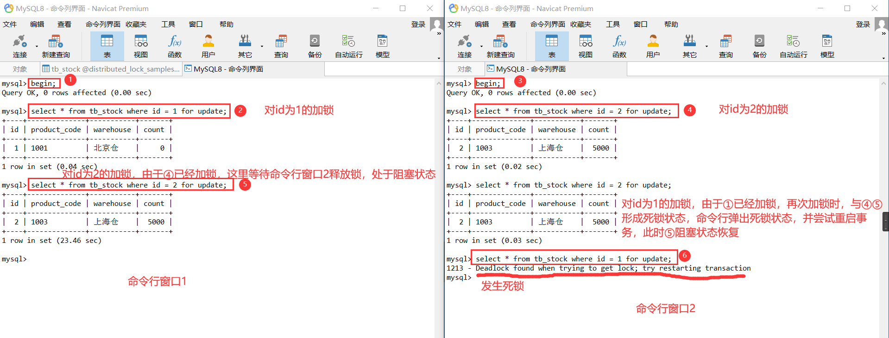
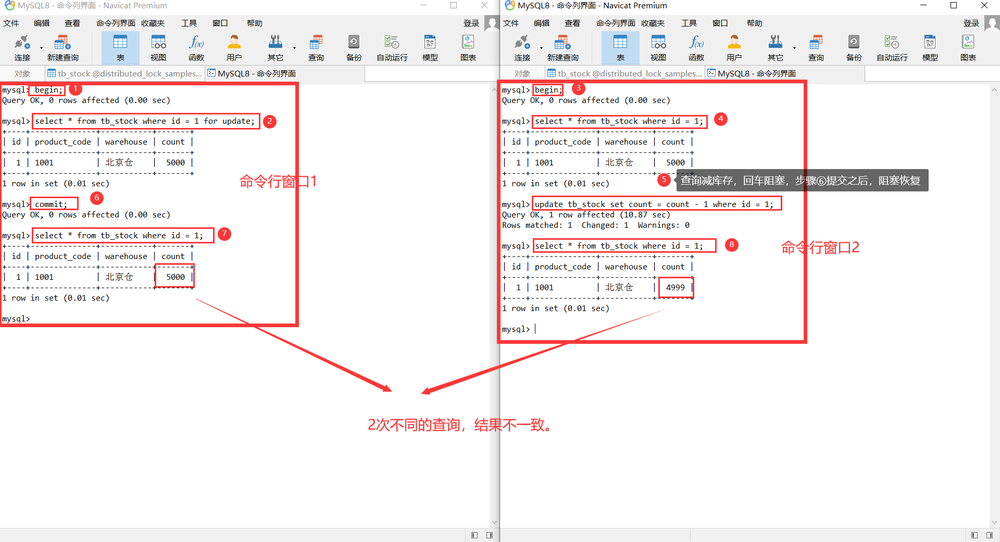
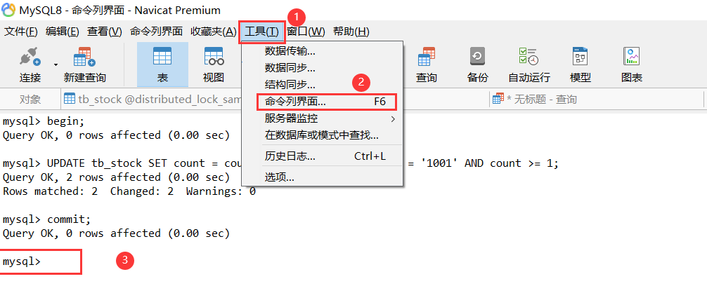

# 分布式锁

## jvm本地锁

### 概念

**jvm本地锁**就是常见的应用程序的锁机制，也就是使用 `synchronized` 以及 **JUC** 包下的 `ReentrantLock` 锁等等对程序进行并发控制的机制。

### 示意图


### MySQL数据库下jvm锁失效的情况

记住锁失效的前提必须是使用了**锁机制**，同时还配合数据库来使用，这里以 MySQL 举例说明，导致jvm锁失效的情况，其他数据库请自行测试。

#### 多例模式

多例模式就是创建多个相同的应用程序实例，各个程序之间相互隔离。此方式下会导致锁失效，具体代码参考 `PrototypePatternStockServiceImpl`。

这里贴出核心关键代码，代码如下：

```java
/**
 * 库存业务 接口实现类
 * （多例模式，注意和单例模式的区别）
 * <p>
 * 注意：当使用多例模式情况下，要保证 proxyMode 的值不为 ScopedProxyMode.DEFAULT(与ScopedProxyMode.NO等同)，
 * 否则只改变 value 的值为 “prototype”，此时还是按照单例模式来处理
 * <p>
 * 扩展：原生 spring 默认使用 jdk 动态代理（实现接口），而 SpringBoot 2.X 使用 CGLIB 代理（基于类代理），由于这里采用的是实现类方式，所以使用 jdk 动态代理方式
 */
// @Scope(value = ConfigurableBeanFactory.SCOPE_PROTOTYPE)
@Scope(value = ConfigurableBeanFactory.SCOPE_PROTOTYPE, proxyMode = ScopedProxyMode.INTERFACES)
public class PrototypePatternStockServiceImpl implements IPrototypePatternStockService {

    /**
     * 减库存（超卖问题），基于 MySQL 数据库，使用 synchronized 锁，多例模式下，此方式会失效
     */
    @Override
    public synchronized void baseMysqlDeductWithSynchronizedLock() {
        // ...
    }

    /**
     * 减库存（超卖问题），基于 MySQL 数据库，使用 ReentrantLock 锁，多例模式下，此方式会失效
     */
    @Override
    public void baseMysqlDeductWithReentrantLock() {
        // ...
    }
}
```

#### spring 事务

基于 **spring** 事务来处理，使用 `@Transactional` 注解来实现事务，底层利用 aop 思想实现的。此方式下会导致锁失效，可以通过使用“读未提交”[事务隔离级别](事务隔离级别.md)
来解决失效问题，但实际项目不采取这么用，具体代码参考 `TransactionalStockServiceImpl`

这里贴出核心关键代码，代码如下：

```java
/**
 * 库存业务 接口实现类
 * 基于 spring 事务来处理
 */
public class TransactionalStockServiceImpl implements ITransactionalStockService {

    /**
     * 减库存（超卖问题），基于 MySQL 数据库，使用 事务 + synchronized 锁，spring 事务模式下，此方式会失效
     * <p>
     * 为什么会失效呢？因为 MySQL 默认事务隔离级别为 “可重复读”（repeatable read 简称 rr）
     * <p>
     * 要想解决这个问题，可以参考 {@link TransactionalStockServiceImpl#baseMysqlDeductWithReentrantLock} 方法事务的使用，
     * 其实就是 {@code @Transactional} 注解将隔离级别从 “默认”（aop 底层默认采用数据库的隔离级别） 改为 “读未提交”（read uncommitted 简称 ru），
     * 这样一来就可以读取还未提交的数据，但是也有缺点，会带来脏读等问题。这里只在当前示例中这样使用，但是实际互联网项目中采用的是 “读已提交”（read committed 简称 rc）事务隔离级别
     */
    @Override
    @Transactional
    public synchronized void baseMysqlDeductWithSynchronizedLock() {
        // ...
    }

    /**
     * 减库存（超卖问题），基于 MySQL 数据库，使用 事务 + ReentrantLock 锁，使用 spring 下的 “读未提交” 事务隔离级别来解决，并发失效的问题
     * <p>
     * 注意：这里只在当前示例中这样使用，但是实际互联网项目中采用的是 “读已提交”（read committed 简称 rc）事务隔离级别
     */
    @Override
    @Transactional(isolation = Isolation.READ_UNCOMMITTED)
    public void baseMysqlDeductWithReentrantLock() {
        // ...
    }
}
```

#### 应用程序集群部署

从思想来理解的话，其实跟多例模式的情况类似，只是所处的容器不同而已。集群部署需要使用 nginx 均衡负载，nginx.conf配置内容如下：

```text
worker_processes  1;

events {
    worker_connections  1024;
}


http {
    include       mime.types;
    default_type  application/octet-stream;

    sendfile        on;
    keepalive_timeout  65;
	
    # 负载均衡
    upstream distributedLockSample {
        server localhost:10010;
        server localhost:10086;
    }

    server {
        listen       80;
        server_name  localhost;

        # 反向代理
        location / {
            proxy_pass http://distributedLockSample;
        }
    }
}
```

为了测试集群，使用idea开2个不同的实例，配置实例截图如下：


环境变量设置如下：

```text
--server.port=10086
```

### MySQL数据库下jvm锁失效的解决方案

上述就是 MySQL 下导致 jvm 锁失效的三种情况。那么我们是不是只需要避免这种三种情况就行了？其实实际的业务需求中，多例模式情况下，我们是可以避免的，但是 spring 事务和集群部署情况是无法避免的。
因此我们需要使用其他方式来解决。

- 这里最简单的方式就是利用 MySQL 的**原子性**，也就是“行锁”或者“表锁”。所以需要修改 SQL 的执行逻辑，参考 `StockMapper.xml` 的代码逻辑。代码如下：

```xml

<update id="updateStock">
    UPDATE tb_stock
    SET count = count - #{count}
    WHERE
    product_code = #{productCode}
    AND count >= #{count}
</update>
```

但是有如下三个问题存在（2和3比较好理解，1通过悲观锁来说明）：

#### 1. 锁范围问题，是表级锁还是行级锁，需要考虑范围，以下通过悲观锁思想来说明这个问题；

#### 2. 同一个商品有多条库存记录，需要编写对应的 SQL 实现，较为复杂；

为了演示这个实例，插入一条新数据。

```sql
INSERT INTO `distributed_lock_samples`.`tb_stock`(`id`, `product_code`, `warehouse`, `count`)
VALUES (2, '1001', '上海仓', 5000);
```

现象：当使用 `StockMapper.xml` 进行查询 productCode 为 "1001" 的数据会出现2条，这2条都会减库存，显然不符合逻辑，这里只是举个例子，具体的应用场景要结合业务来编写对应的 SQL
或者使用“悲观锁（select ... for update）”来解决这个问题，具体使用可以查看后续悲观锁的示例。

#### 3. 无法记录库存变化前后的状态，比如查询减库存之后的数据，只能重新执行查询 SQL；

##### 悲观锁（select ... for update）
**悲观锁**，顾名思义，就是持悲观态度的锁。就在操作数据时比较悲观，每次去拿数据的时候认为别的线程也会同时修改数据，所以每次在拿数据的时候都会上锁，这样别的线程想拿到这个数据就会阻塞直到它拿到锁。

为了演示这个悲观锁实例，往数据库再插入一条新数据。

```mysql
INSERT INTO `distributed_lock_samples`.`tb_stock`(`id`, `product_code`, `warehouse`, `count`)
VALUES (3, '1002', '深圳仓', 5000);
```

###### 表级锁

通过开启 Navicat 的2个命令行窗口来演示这个效果，如下图所示：


命令行窗口1 SQL 内容如下：

```mysql
-- 开启事务
begin;

-- 修改产品编号为 “1001” 的库存 SQL
UPDATE tb_stock
SET count = count - 1
WHERE product_code = '1001'
  AND count >= 1;
```

命令行窗口2 SQL 内容如下：

```mysql
-- 修改编号为 3 的库存 SQL
UPDATE tb_stock
SET count = count - 1
WHERE id = 3;
-- 回车之后，命令行窗口处于阻塞状态
```

通过截图步骤不难看出，`StockMapper.xml` 对应 SQL 锁的范围使用的是“表级锁”，当命令行窗口1未执行提交事务命令（commit;）或者回滚事务命令(rollback;)
，命令行窗口2一直处于阻塞状态；当执行提交或者回滚事务之后，阻塞状态结束，如图所示：


命令行窗口1 SQL 内容如下：

```mysql
-- 提交事务
commit;
-- 或者 回滚事务
-- rollback;
```

命令行窗口2 SQL 内容如下：

```mysql
-- 阻塞状态结束，SQL 执行成功
```

通过上述分析，`StockMapper.xml` 对应 SQL 锁的范围使用的是“表级锁”，那能不能将“表级锁”转成“行级锁”呢？答案是有的。满足如下条件是可以实现行级锁的：

###### 行级锁

1. 锁的查询或者更新条件必须是索引字段（主键索引、普通索引、唯一索引、全文索引等等），为了演示这个示例，需要对 ”product_code“ 字段新建普通索引，命令如下：

```mysql
ALTER TABLE `tb_stock`
    ADD INDEX `idx_pc` (`product_code`) COMMENT '产品编号普通索引';
```

同样地，我们通过截图重新演示一下在加完索引字段的情况下是“表级锁”还是“行级锁”，如下图所示：


命令行窗口1 SQL 内容如下：

```mysql
-- 开启事务
begin;

-- 修改产品编号为 “1001” 的库存 SQL
UPDATE tb_stock
SET count = count - 1
WHERE product_code = '1001'
  AND count >= 1;
```

命令行窗口2 SQL 内容如下：

```mysql
-- 修改编号为 3 的库存 SQL
UPDATE tb_stock
SET count = count - 1
WHERE id = 3;
-- 回车之后，命令行窗口执行结束
```

通过截图步骤不难看出，当命令行窗口1是否执行事务命令，对命令行窗口2来说没有任何影响，因此我们可以得出**给指定字段添加索引能实现行级锁**的结论，但必须还要满足一个条件就是“查询或者更新条件必须是具体值”，否则有可能还是表级锁。

2. 查询或者更新条件必须是具体值（比如：in 和 = 表示具体值；like 和 != 表示非具体值），为了演示这个示例，需要重新编写 SQL 语句，如下图所示：


命令行窗口1 SQL 内容如下：

```mysql
-- 开启事务
begin;

-- 修改产品编号不为 “1002” 的库存 SQL
UPDATE tb_stock
SET count = count - 1
WHERE product_code != '1002'
  AND count >= 1;

-- 或者
UPDATE tb_stock
SET count = count - 1
WHERE product_code LIKE '%001'
  AND count >= 1;
```

命令行窗口2 SQL 内容如下：

```mysql
-- 修改编号为 3 的库存 SQL
UPDATE tb_stock
SET count = count - 1
WHERE id = 3;
-- 回车之后，命令行窗口执行结束
```

通过截图步骤不难看出，即使**给指定字段添加索引**，但是不满足“查询或者更新条件必须是具体值（比如：in 和 = 表示具体值；like 和 != 表示非具体值）”这个条件的话，使用的还是表级锁，当事务提交或者回滚之后，锁才释放。

3. 通过代码层面来实现 SELECT ... FOR UPDATE 悲观锁，有效避免超卖问题（还可以解决同一个商品有多条库存记录同时减库存的问题，原理实现行级锁），SQL 命令及代码如下：

命令行窗口示例演示 SQL 命令如下：

```mysql
-- 命令行窗口1的SQL
begin;
SELECT *
FROM `tb_stock`
WHERE product_code = '1001' FOR
UPDATE;

-- 命令行窗口2的SQL（回车阻塞）
UPDATE `tb_stock`
SET count = count - 1
WHERE id = 1;

-- 命令行窗口1的SQL（命令行窗口2的SQL结束执行，锁释放掉了）
commit;
-- 或者
rollback;
```

代码如下（具体代码可以参考 `TransactionalDbLockStockServiceImpl`；SQL 代码逻辑可以参考 `StockMapper.xml`）：

```java
public class TransactionalDbLockStockServiceImpl implements ITransactionalDbLockStockService {

    /**
     * 使用 select ... for update 更新减库存，悲观锁（行级锁），QPS为 497.4/sec，有效解决超卖问题
     * <p>
     * 这里通过使用 {@code @Transactional} 事务注解来自动加锁以及释放锁。如果是 SQL 脚本执行下面代码逻辑，流程是这样子的：
     */
    @Override
    @Transactional
    public void deductWithDbLockForUpdate() {
        // 1.查询库存信息并锁定库存信息

        // 2.判断库存是否充足

        // 3.扣减库存
    }
}
```

通过上述可知，使用数据库的悲观锁（表级锁或者行级锁）配合事务注解自动加锁或者释放锁来避免超卖问题，还可以解决同一个商品有多条库存记录同时减库存的问题，主要是是通过行级锁来实现。

通过对上述分析，其实悲观锁也不是完美的，也会出现如下三种问题：

- 性能问题

关于性能测试结果请参考 [并发测试对比结果](并发测试对比结果.md) 文档

- 死锁问题（对多条数据加锁时，要保持加锁的顺序一致）

**死锁**是指**两个或两个以上的进程**在执行过程中，由于**竞争资源**或者**由于彼此通信**而造成的**一种阻塞的现象**，若*无外力作用，它们都将无法推进下去*。

关于 JVM 死锁，参考 [死锁](./死锁.md) 文档说明。

数据库发生死锁示例，如图所示：



现象描述：

> 命令行窗口1：<br>
> ①、开启事务<br>
> ②、对id为1的记录进行加锁<br>
> 
> 命令行窗口2：<br>
> ③、开启事务<br>
> ④、对id为2的记录进行加锁<br>
> 
> 命令行窗口1：<br>
> ⑤、对id为2的记录进行加锁，由于id为2的记录另外一个应用程序（命令行窗口2，即步骤④）加锁，等待其释放锁才能继续执行，所以处于阻塞状态<br>
> 
> 命令行窗口2：<br>
> ⑥、对id为1的记录进行加锁，由于id为1的记录另外一个应用程序（命令行窗口1，即步骤①）加锁，等待其释放锁才能继续执行，与步骤⑤形成了“循环等待条件”，从而形成了死锁，因此客户端提示死锁异常。<br>

- 库存操作要统一（select ... for update 查询并加锁 和 普通 select 查询2种要统一）

库存操作不统一演示示例，如图所示：



现象描述：

> 命令行窗口1：<br>
> ①、开启事务<br>
> ②、对id为1的记录进行加锁<br>
>
> 命令行窗口2：<br>
> ③、开启事务<br>
> ④、对id为1的记录进行查询<br>
> ⑤、修改id为1这条记录库存量<br>
> 
> 命令行窗口1：<br>
> ⑥、提交事务<br>
> ⑦、对id为1的记录进行查询<br>
> 
> 命令行窗口2：<br>
> ⑧、对id为1的记录进行查询<br>

通过截图或者上述操作可以看出，最终2个命令行执行的结果出现误差，查询的结果不一致（步骤⑤是为了演示效果，执行修改操作会阻塞，最终2个命令行提交事务，结果会一致，但是代码层面这步出错的概率很大，也就是一个操作对另一个操作无法进行感知，简单点说就是一个用户修改了数据，对于另一个用户来说，不知道使用的数据被修改了，还是旧数据），由此可以看出库存操作要统一。

##### 乐观锁（时间戳 version版本号 CAS机制）

**乐观锁**，顾名思义，就是持比较乐观态度的锁。就是在操作数据时非常乐观，认为别的线程不会同时修改数据，所以不会上锁，但是在更新的时候会判断在此期间别的线程有没有更新过这个数据。

###### CAS
Compare And Swap(Set) 比较并交换

关于CAS不得不引出如下概念：
> **变量X 旧值A 新值B** <br>
> 
例如：用户修改密码的应用场景
> 用户名输入的密码        ->   变量X<br>
> 旧密码                ->   旧值A<br>
> 新密码                ->   新值B<br>

记忆理解：只有当输入的密码（变量X）与旧密码（旧值A）相同时，才进行修改新密码（新值B）；否则，不执行修改密码操作，这就是CAS机制。

**乐观锁**，大多是基于**数据版本**(Version)记录机制实现。何谓数据版本？即为数据增加一个版本标识，在基于数据库表的版本解决方案中，一般是通过为数据库表增加一个 “version” 字段来实现。

###### 版本号

读取出数据时，将此版本号一同读出，之后更新时，对此版本号加一。此时，将提交数据的版本数据与数据库表对应记录的当前版本信息进行比对，如果提交的数据版本号大于数据库表当前版本号，则予以更新，否则认为是过期数据。

SQL 伪代码：
```sql
update table_name

set variable_field=2, version=version+1

where id=#{id} and version=#{version};
```

向 tb_stock 表中在 count 字段后面插入 version 字段
```mysql
alter table tb_stock add column `version` int default '0' comment '版本号' after count; 
```

SQL代码：
```mysql
update tb_stock set count=2, version = version + 1 where id='1' and version='0';
```

###### 时间戳
时间戳机制，同样是在需要乐观锁控制的表中增加一个字段，名称无所谓，字段类型使用时间戳（timestamp）, 和上面的 version 类似，也是在更新提交的时候检查当前数据库中数据的时间戳和自己更新前取到的时间戳（控制到秒级）进行对比，如果一致则OK，否则就是版本冲突。

### 扩展

问：如何开启多个 Navicat 工具？

答：点击 Navicat 工具栏中的【工具】，选择【选项】，然后在弹出的窗口中【常规】标签卡主页面中勾选 【允许重复运行Navicat】 和 【允许重复打开相同的对象】复选框重启即可！如下图所示：


问：如何打开 Navicat 命令行窗口？

答：点击 Navicat 工具栏中的【工具】，选择【命令行界面】或者使用快捷键【F6】，就会打开命令行编辑界面。如下图所示：



